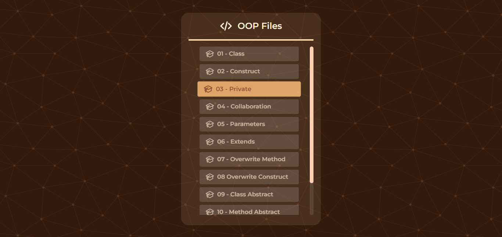
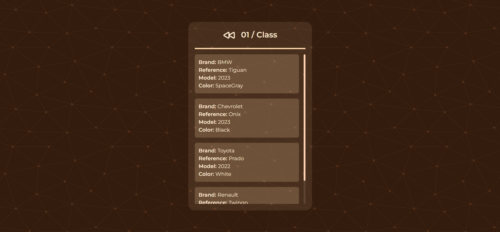
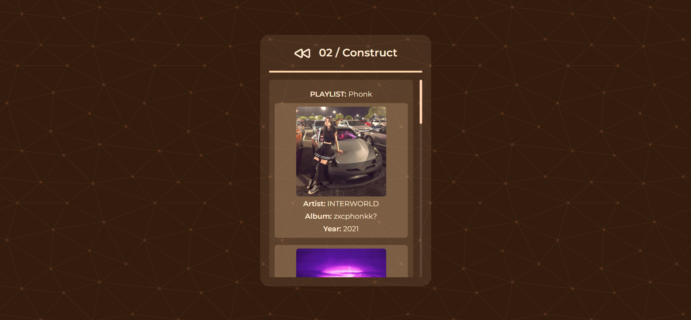
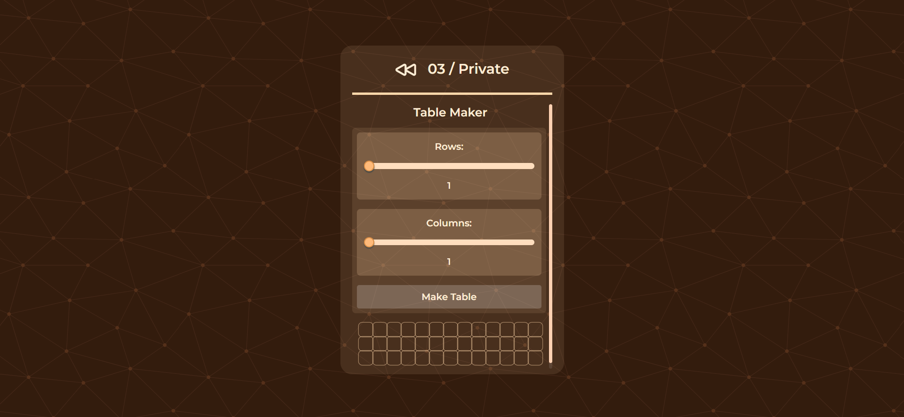

# Project 01 OOP
This is a repository of a project that i made in the university class called `Object-oriented programming`.

# Images of the Project





# Console Commands
For execute the `localhost` server, we need install [XAMPP](https://www.apachefriends.org/es/index.html) and turn on the `Apache` module; Next open the [Windows Terminal](https://github.com/microsoft/terminal) and execute the next command:

```
php -S localhost:8080 -t ./
```

> **Note**: In case of the Windows Terminal isn't work, open "Shell" in the XAMPP Control Panel 
